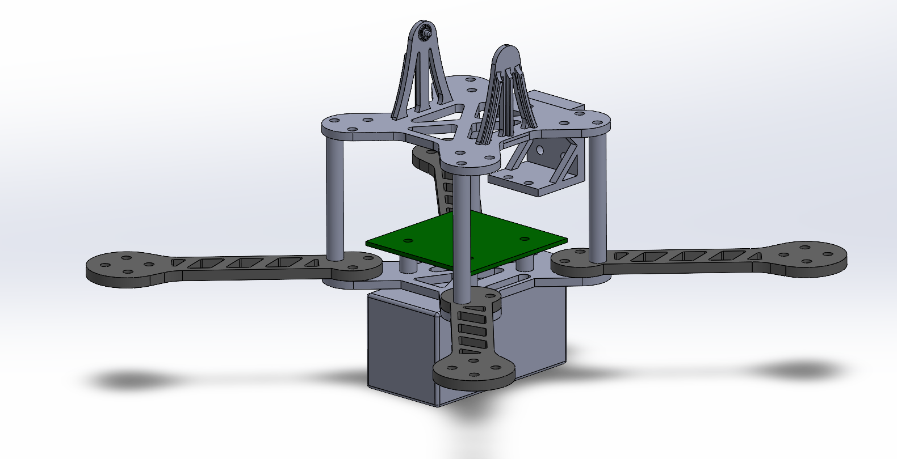
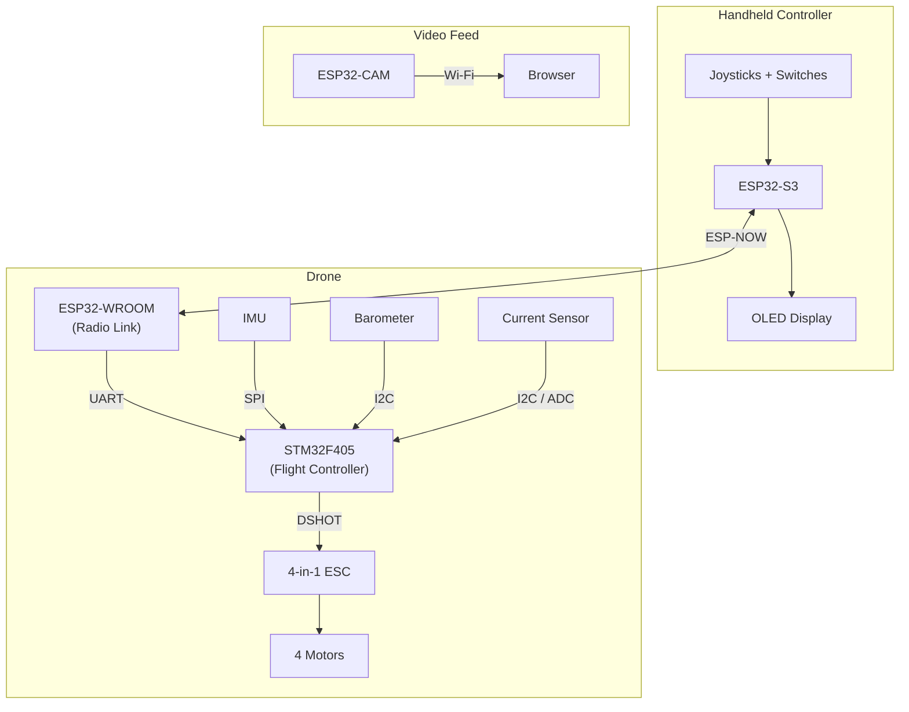
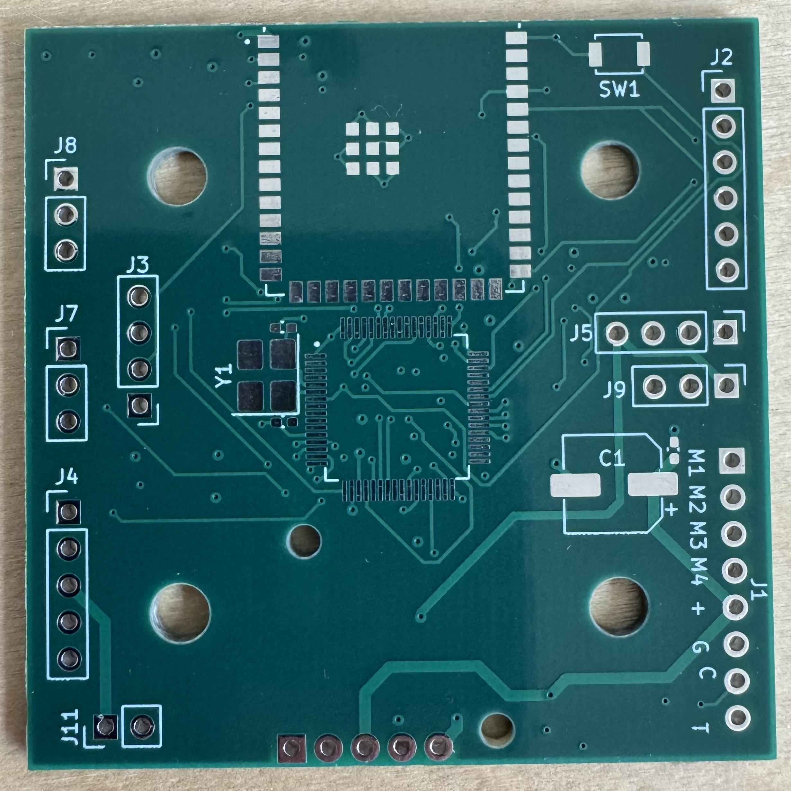
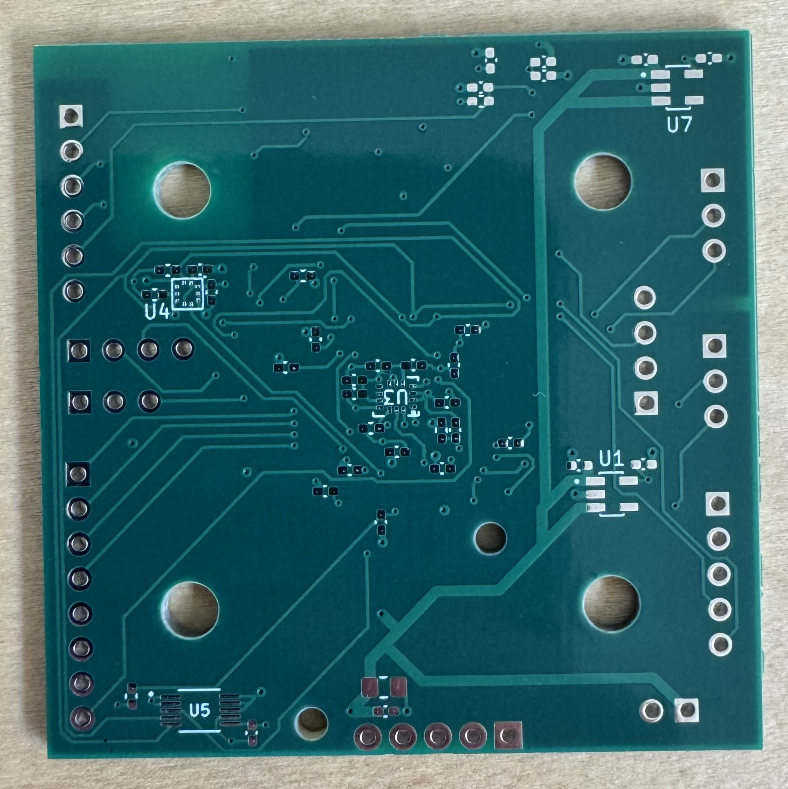

# Custom FPV Quadcopter
A custom quadcopter built from scratch: STM32F405 flight controller PCB, embedded firmware, ESP-NOW wireless controller, and 3D-printed frame.

## Overview

This project is a 5-inch FPV quadcopter featuring a fully custom frame, electronics package, and firmware built from individual parts using university equipment and resources. At its core is a custom 4-layer flight controller PCB built around an STM32F405 microcontroller, interfacing with an IMU and barometer over SPI, I²C, and UART. The drone communicates wirelessly through ESP-NOW with a custom handheld controller, and the goal is to achieve stable flight with live video streaming from an onboard camera.

The motivation behind the project is to gain hands-on experience in PCB design, embedded systems, and industry tools including KiCad, SolidWorks, and STM32CubeIDE. In addition, I find flight and aerial technology fascinating as they draw multiple engineering concepts to life. Rather than using an off-the-shelf flight controller, designing the project from the ground up meant working through the full engineering process, integrating mechanical design, embedded systems, and software development.

The part I'm most proud of is the flight controller PCB. Designing it from a blank schematic meant making every engineering decision myself, including component selection, power architecture, sensor integration, and layout with attention to multi-rail power distribution and noise isolation, which are all choices and considerations crucial to the performance of the drone. 

Future goals: autonomous flight capabilities and a potential payload claw mechanism.

## System Architecture

The system is split into three independent subsystems: a handheld 3D-printed controller, the drone's flight and communication electronics, and a standalone video feed. The controller and drone communicate wirelessly over ESP-NOW, while the onboard ESP32-CAM streams video directly to a browser over its own Wi-Fi connection.

## Hardware

### Flight Controller PCB

The flight controller is a custom 4-layer PCB (52 × 52 mm) built around an STM32F405RGT6 microcontroller (168 MHz Cortex-M4F). It integrates all sensing, power regulation, and motor interfacing needed to fly the quadcopter on a single compact board.

**Key components:**
- **MCU:** STM32F405RGT6 (168 MHz Cortex-M4F, 1 MB flash)
- **IMU:** BMI270 (SPI) — gyroscope and accelerometer for attitude sensing
- **Barometer:** BMP384 (I2C) — altitude measurement
- **Power monitor:** INA226 (I2C) — battery voltage and current sensing
- **Motor interface:** DSHOT to a 4-in-1 ESC
- **Wireless link:** UART to an onboard ESP32-WROOM

**Power architecture:** The board runs directly off a 4S LiPo, stepping the battery voltage down to a 5 V rail via a buck regulator, then to separate 3.3 V rails through LDOs — including a dedicated rail for the ESP32 to isolate it from the flight-critical electronics.

**Design highlights:** careful multi-rail power distribution, decoupling placed close to each IC, isolation of sensitive sensor signals from noisy switching lines, and dense signal routing across all four layers.

**Design files:**

| Schematic | PCB Layout |
|-----------|-----------|
|  |  |

**Fabricated board:**

| Top Side | Bottom Side |
|----------|-------------|
|  |   |

### Handheld Controller PCB

A custom PCB built around an ESP32-S3, featuring two analog joysticks, arm and mode switches, and an OLED display for live status and telemetry. The controller sends flight commands and receives telemetry over ESP-NOW.

